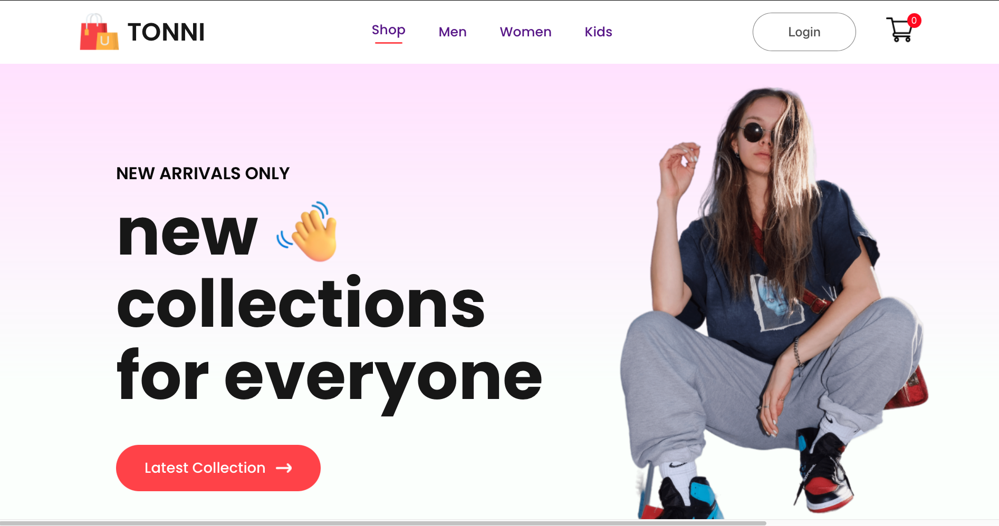
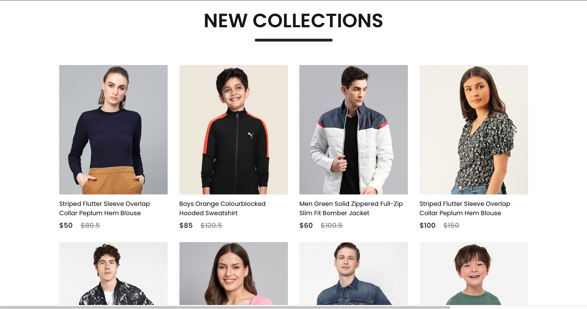
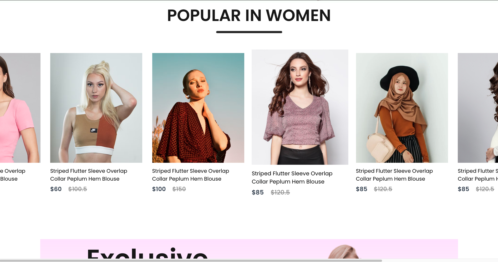
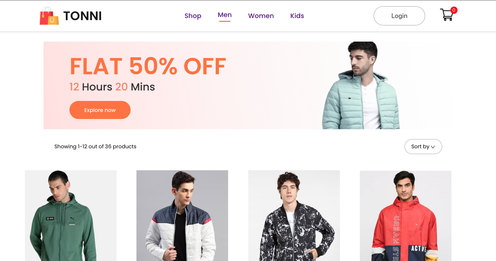
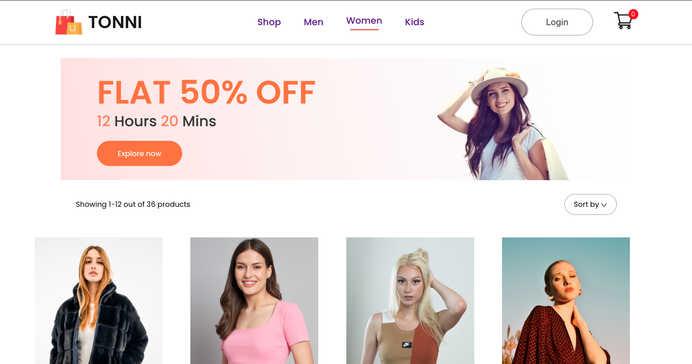
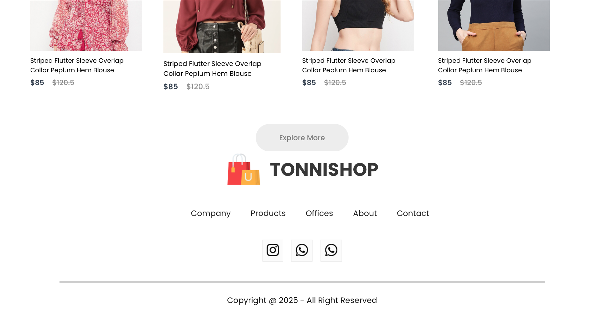
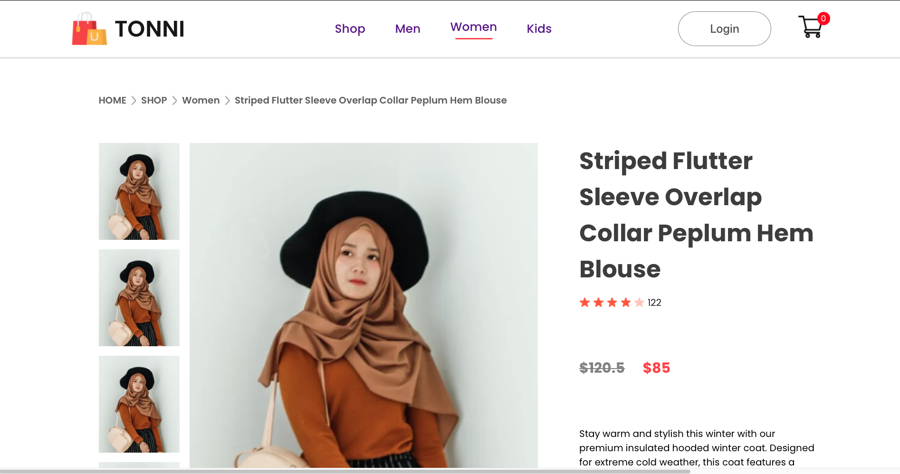
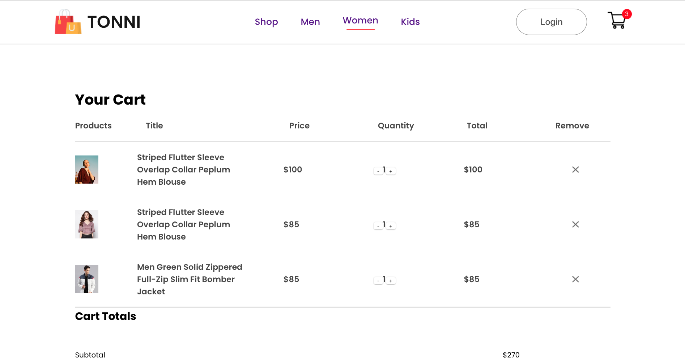
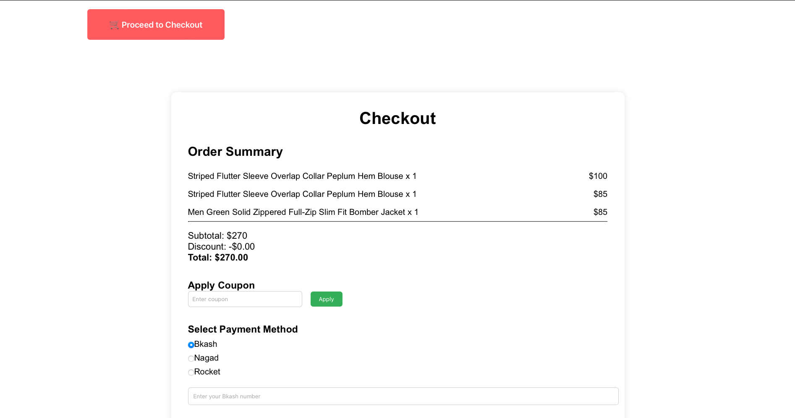

# 🛍️ TONNIShop – Full-Stack E-Commerce Platform

TONNIShop is a **full-stack e-commerce web application** built with a modern MERN stack.  
It provides customers with a smooth shopping experience and admins with a simple dashboard to manage products.  

---

## 📸 Screenshots

### 🏠 Homepage

### 🛒 Product Listing

### 🛒 Popular in Women

### 🛒 Mens Products

### 🛒 Womens Products

### 🛒 Footer

### 🛒 Single Products

### 📦 Cart 

### ⚙️ Checkout

> 📌 Place your real screenshots inside a `screenshots/` folder in the repo.

---

## 🚀 Features

### 👤 User
- Browse products by category  
- View product details  
- Add to cart / remove from cart  
- Checkout with order summary  
- Responsive design (mobile + desktop)

### 🛠️ Admin
- Add, edit, delete products  
- Manage categories & pricing  
- Track user orders  

### ⚙️ Technical
- Frontend: **React + Context API**  
- Backend: **Node.js + Express**  
- Database: **MongoDB**  
- Deployment: **Vercel** (frontend) & **Heroku/Render** (backend)  

---

## 📂 Project Structure

# 🛍️ TONNIShop – Full-Stack E-Commerce Platform

TONNIShop is a **full-stack e-commerce web application** built with a modern MERN stack.  
It provides customers with a smooth shopping experience and admins with a simple dashboard to manage products.  

---

## 📸 Screenshots

### 🏠 Homepage

> 📌 Place your real screenshots inside a `screenshots/` folder in the repo.

---

## 🚀 Features

### 👤 User
- Browse products by category  
- View product details  
- Add to cart / remove from cart  
- Checkout with order summary  
- Responsive design (mobile + desktop)

### 🛠️ Admin
- Add, edit, delete products  
- Manage categories & pricing  
- Track user orders  

### ⚙️ Technical
- Frontend: **React + Context API**  
- Backend: **Node.js + Express**  
- Database: **MongoDB**  
- Deployment: **Vercel** (frontend) & **Heroku/Render** (backend)  

---

## 📂 Project Structure

📊 Roadmap
 User authentication (JWT)
 Wishlist & favorites
 Payment gateway integration
 Order tracking system
🤝 Contributing
Pull requests are welcome. For major changes, please open an issue first to discuss what you’d like to change.
📜 License
Distributed under the MIT License. See LICENSE for details.
👩‍💻 Author
Fahmida Ahmed Tonni
💼 Machine Learning Engineer | 💡 Full-Stack Enthusiast
🌐 Portfolio Website | LinkedIn | GitHub
